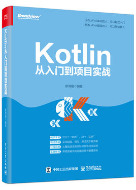

# Kotlin从入门到项目实战

本仓库为《Kotlin从入门到项目实战》一书的第26章的项目源代码。

本书是Kotlin跨平台编程语言的实战型工具书，全书力求以“简洁的语言+大量实例”风格进行讲解，能够帮助熟悉Java语言或“零基础编程”的读者快速掌握Kotlin。

### 书本封面

## 购买链接：

- 京东：https://item.jd.com/12684712.html
- 当当：http://product.dangdang.com/27920283.html

